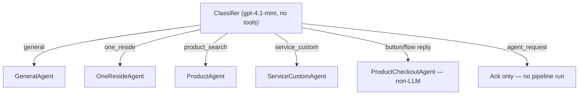
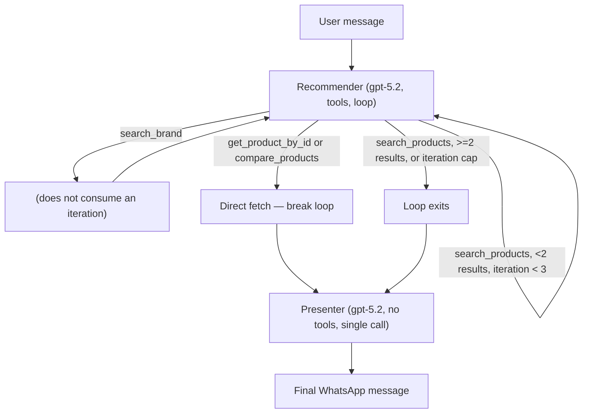

# OneReside Bot — Agent Design

**Author:** Pratham Paleriya (prathampaleriya)
**Last updated:** 2026-07-22

> This doc covers every LLM-backed agent (and the non-LLM processors they
> sit alongside) in field-level detail: which model each uses, its
> tool-calling shape, the exact tools it exposes, and its structured output
> schema. For how a message reaches an agent in the first place (webhook →
> classifier → pipeline dispatch), see `resources/ARCHITECTURE.md` §4, which
> this doc assumes as background. For the Mongo/Chroma data each tool reads
> from, see `resources/DATABASE_DESIGN.md`.

---

## 1. What this doc covers

For each conversational agent (a `Processor` subclass in
`onereside_chatbot/processors/`), this doc answers: what model it calls,
whether it makes one call or loops over multiple rounds of tool-calling, the
exact tools it can invoke (name + parameters), what structured output shape
it must return, and — in plain English — what its system prompt instructs
it to do. Non-LLM processors (`ProductCheckoutAgent`, `QRProcessor`,
`ResponseManager`) are included for completeness since they sit in the same
pipelines, but are documented briefly since they have no model/tool surface.

---

## 2. Core concepts / glossary

| Term | Meaning |
|---|---|
| Agent | A `Processor` (`processors/*.py`) that calls an OpenAI model, as opposed to a pure-logic processor. |
| Tool-call round | One request/response cycle with the model where it may return `function_call` items instead of (or before) a final answer. |
| Structured output (`text=output_schema`) | The OpenAI Responses API `text` param constraining the model's final answer to a fixed JSON schema — every agent uses this for its last call. |
| Recommender / presenter split | `ProductAgent`'s two-stage design: one model call searches/fetches candidate products via tools, a **separate** model call (no tools) then writes the final customer-facing message from the results already fetched. |
| `set_agent(data, ...)` | Writes the active agent name + model into the per-turn debug `trace` (`utils/trace.py`), surfaced in the `messages.context` field (see `DATABASE_DESIGN.md` §5). |
| Shared client vs. shared helper | Two different, **not interchangeable** code paths call OpenAI in this codebase — see §11. |

---

## 3. Agents at a glance

| Agent | LLM? | Model(s) | Pipeline (see ARCHITECTURE.md §4.4) |
|---|---|---|---|
| `Classifier` | Yes | `gpt-4.1-mini` | `InitialPipeline` |
| `QRProcessor` | No | — | `InitialPipeline` |
| `GeneralAgent` | Yes | `gpt-4.1-mini` | `GeneralPipeline` |
| `OneResideAgent` | Yes | `gpt-4.1-mini` | `OneResidePipeline` |
| `ProductAgent` | Yes (2 sub-calls) | `gpt-5.2` | `ProductSearchPipeline` |
| `ServiceCustomAgent` | Yes | `gpt-5.2` | `ServiceCustomPipeline` |
| `ProductCheckoutAgent` | No | — | `ProductCheckoutPipeline` |
| `ResponseManager` | No | — | Runs after every pipeline (dispatch only) |

---

## 4. Classifier

**Role:** assign one of 5 intent categories to a free-text message, or
short-circuit routing for button/Flow replies (the short-circuit itself
happens in `Classifier.process`, before any model call — see
`ARCHITECTURE.md` §4.3).

- **Model:** `gpt-4.1-mini`.
- **Control flow:** single call, via the shared helper
  `get_openai_responses(agent_name, model, instruction, messages)`
  (`utils/get_openai_responses.py`).
- **Tools:** none.
- **Output:** **not** an OpenAI structured-output schema — the helper's
  `output_format` is left `None`. The JSON shape `{"category": "<category>"}`
  is enforced only by prompt instruction and parsed with a manual
  `json.loads()` (`processors/classifier.py:121`). `category` ∈ `general |
  product | service_custom | one_reside | agent_request`.
- **Prompt covers:** classifies intent from the message plus the last 8
  turns of chat history, with disambiguation rules (e.g. "enquire about a
  brand" → `service_custom` even mid-conversation with another agent; "talk
  to a human" → `agent_request`) and ~32 worked examples.

---

## 5. GeneralAgent

**Role:** brand-scoped concierge — answers questions about **one specific
brand** the user is currently in the context of (via QR scan or prior
selection).

- **Model:** `gpt-4.1-mini` for both calls.
- **Control flow:** up to 2 calls via the raw `openai_client.responses.create`
  (not the shared helper). Call 1 passes `tools=[...]`, `tool_choice="auto"`.
  **If the model returns more than one `function_call`, only the last one is
  executed** — the code overwrites a single `tool_call` variable in a loop
  rather than collecting all of them. If a tool was called, exactly one
  follow-up call is made with the tool result appended, `text=output_schema`,
  no tools.
- **Tools:**

  | Tool | Parameters |
  |---|---|
  | `list_all_brands` | none |
  | `search_brands` | `query` (string, required) |

- **Structured output:** schema `whatsapp_message` → `{"message": string}`.
- **Prompt covers:** "One Reside Concierge" persona scoped to
  `{brand_name}`; answers only from that brand's `brand_additional_context`/
  description/categories; sells "without selling"; redirects anything
  outside home/furnishing/this-brand back on topic.

---

## 6. OneResideAgent

**Role:** platform-wide concierge — how One Reside works, cross-brand
discovery, policies (returns/delivery/payment/trust) — as opposed to
`GeneralAgent`'s single-brand scope.

- **Model:** `gpt-4.1-mini` for both calls.
- **Control flow:** same 2-call shape as `GeneralAgent`, but **executes every**
  `function_call` the model returns in that round (not just the last),
  appending a `function_call_output` for each before the single follow-up call.
- **Tools:**

  | Tool | Parameters |
  |---|---|
  | `list_all_brands` | none |
  | `search_brands` | `query` (string, required) |

- **Structured output:** same `whatsapp_message` → `{"message": string}` shape.
- **Prompt covers:** platform-wide concierge behavior, brand discovery
  across the whole catalogue, policy Q&A, redirecting to product/service
  pipelines when the user wants to actually shop or book.
- **Known gap:** the prompt repeatedly instructs the model to call a tool
  named **`one_reside_kb_search(query)`** for platform-policy questions, but
  no such tool is defined or passed to the model — only `search_brands` and
  `list_all_brands` exist in code. This is a stale/aspirational prompt
  reference; the model will either hallucinate the call (dropped, since it's
  not in the tool list) or fall back to answering from its instructions
  alone. Worth fixing on either side (add the tool, or remove the reference).

---

## 7. ProductAgent — ready-made product search

**Role:** find and present off-the-shelf products (not services or
made-to-order — those route to `ServiceCustomAgent`). Internally split into
two sub-agents that never share a prompt or tool list.

### 7.1 Recommender
- **Model:** `gpt-5.2`, `reasoning={"effort": "low"}`.
- **Control flow:** a genuine iterative loop, `while iteration <
  MAX_SEARCH_ITERATIONS` (`MAX_SEARCH_ITERATIONS = 3`),
  `parallel_tool_calls=False`. Exit conditions: no tool call returned; a
  `compare_products` or `get_product_by_id` call (fetches directly, breaks
  immediately); a `search_products` call returning ≥2 products, or the
  iteration cap hit. A `search_brand` call does **not** consume an iteration.
  An acknowledgement WhatsApp text fires once mid-loop before the first tool
  result returns, so the user isn't left waiting silently through multiple
  rounds.
- **Tools:**

  | Tool | Parameters |
  |---|---|
  | `search_products` | `query` (string, required), `price_min` (number), `price_max` (number), `category` (string), `brand_id` (string), `brand_source` (enum: `user_named` / `active_context` / `cross_brand`), `is_new_topic` (boolean) |
  | `get_product_by_id` | `product_id` (string, required) |
  | `search_brand` | `query` (string, required) |
  | `compare_products` | `product_id_1` (string, required), `product_id_2` (string, required) |

- **Structured output:** `whatsapp_message` → `message` (string),
  `add_needs` (array[string]), `remove_needs` (array[string]).
- **Prompt covers:** ready-made products only; a catalog-existence gate
  (never search outside known categories); a "picture test" question budget
  (max 3 clarifying questions before searching); purchase intent routed to
  `get_product_by_id` instead of a text reply; `brand_source`-driven
  brand-scoping rules; running needs tracking via `add_needs`/`remove_needs`.

### 7.2 Presenter
- **Model:** `gpt-5.2`, `reasoning={"effort": "low"}`, `max_output_tokens=1000`.
- **Control flow:** a single, separate, non-tool call over the (≤3) product
  docs the recommender already fetched, trimmed to a fixed field set before
  being sent to the model.
- **Tools:** none.
- **Structured output:** `product_presenter_response` → `product_id`
  (string|null), `product_ids` (array|null, for comparisons), `show_cta`
  (bool), `message` (string), `add_needs`/`remove_needs` (arrays).
- **Prompt covers:** picks the single best product (or 2, for comparisons)
  from the trimmed results; enforces strict category/brand-mismatch → deny
  rules; writes a fixed 4-line WhatsApp message (hook / standout detail /
  price+delivery / closing question); decides whether to show the "Buy" CTA.

### 7.3 Dead prompt file
`onereside_chatbot/prompt/product_search_v2.py` is **not imported anywhere**
in the repo — `product_search_agent.py` imports exclusively from
`prompt/product_search.py`. `product_search_v2.py` looks like an earlier or
alternate draft (adds a "services" framing, uses emojis, looser
`brand_source` handling) and is safe to remove once confirmed with the team.

---

## 8. ServiceCustomAgent

**Role:** find service providers (architects/designers/consultants) or
custom/made-to-order product brands — the counterpart to `ProductAgent` for
anything that isn't a ready-made product.

- **Model:** `gpt-5.2` for both calls, `reasoning={"effort": "low"}`,
  `max_output_tokens=3000`.
- **Control flow:** at most 2 calls (same "single round of tool-calling"
  shape as `GeneralAgent`/`OneResideAgent`, not a loop). Only the **first**
  function call found is dispatched (via a `_TOOL_HANDLERS` lookup); if one
  was called, a follow-up call is made with its result appended, same model,
  no tools.
- **Tools:**

  | Tool | Parameters |
  |---|---|
  | `search_all_brands` | `query` (string, required) |
  | `search_service_brands` | `query` (string, required) |
  | `search_custom_brands` | `query` (string, required) |

- **Structured output:** `service_custom_response` → `message` (string),
  `brand_id` (string|null), `send_brochure` (boolean).
- **Prompt covers:** forces at least one clarifying question before
  searching/presenting (max 2 questions); presents exactly one brand per
  turn — setting `brand_id` triggers the processor to send the
  catalogue/brochure and an "Enquire Now" button; handles "get in touch
  again" by resurfacing `brand_id` even for a previously shown brand; a
  no-match fallback that offers the human OneReside team instead.

---

## 9. ProductCheckoutAgent (non-LLM)

Confirmed no OpenAI import/call anywhere in `processors/product_checkout.py`.
A pure state machine over WhatsApp interactive replies (button `msgid`
prefixes `enquire$`, `buy$`; Flow `nfm_reply` payloads for `address` and
`address_confirmation`), branching to save enquiries/orders, create a
Razorpay payment link, and emit `bot_response` parts. Full flow documented
in `ARCHITECTURE.md` §4.4 and §5.

---

## 10. QRProcessor (non-LLM)

Confirmed no OpenAI call. Regex-matches the WhatsApp QR deep-link text
(`"I'm interested in (.+?) featured in One Reside"`) against
`get_brand_by_name`, sets brand context on the profile on a match, or
reloads the already-active brand context via `get_brand_by_id` when no QR
text is present in the message.

---

## 11. ResponseManager (non-LLM)

Not an agent — a singleton dispatcher. `handle_responses(data)` walks
`data["bot_response"]` and routes each part by `type` (`text`, `media`,
`flow`, `list`, `quickreply`, `skip`, `cta_url`, `template`) to its matching
sender in `whatsapp_functions/`. Handlers are registered via
`register_handler`, so adding a new response type doesn't require touching
the dispatch loop itself.

---

## 12. Key parameters & flags

| Parameter | Where | Effect |
|---|---|---|
| `MAX_SEARCH_ITERATIONS = 3` | `processors/product_search_agent.py` | Caps the recommender's tool-calling loop. |
| `parallel_tool_calls=False` | `product_search_agent.py` recommender call | Forces one tool call per round instead of a batch. |
| `reasoning={"effort": "low"}` | All `gpt-5.2` calls (ProductAgent, ServiceCustomAgent) | Latency/cost tradeoff — not used on `gpt-4.1-mini` calls. |
| `max_output_tokens` | Presenter (1000), ServiceCustomAgent (3000) | Not set on Classifier/GeneralAgent/OneResideAgent calls. |
| `temperature=0.0` | `get_openai_responses` default (Classifier only) | The 4 direct-client agents don't set temperature explicitly. |

---

## 13. Edge cases & notes

- **`OneResideAgent`'s prompt references a tool named
  `one_reside_kb_search`** for platform-policy questions; the tools actually
  passed to the model for that agent are `search_brands` and
  `list_all_brands` (§6).
- **`GeneralAgent` and `OneResideAgent` handle multi-tool-call rounds
  differently.** If the model returns more than one `function_call` in a
  single round, `GeneralAgent` executes only the last one; `OneResideAgent`
  executes every call returned in that round.
- **Two different code paths call OpenAI.** `Classifier` goes through the
  shared `get_openai_responses` helper (no `tools` support); `GeneralAgent`,
  `OneResideAgent`, `ProductAgent`, and `ServiceCustomAgent` each call
  `openai_client.responses.create` directly and implement their own
  tool-dispatch logic independently, each with its own round-handling
  pattern (§11).
- **Classifier's output shape is enforced only by prompt instruction**,
  parsed manually with `json.loads()`; the other four agents use the
  Responses API's structured-output enforcement (`text=output_schema`).

---

