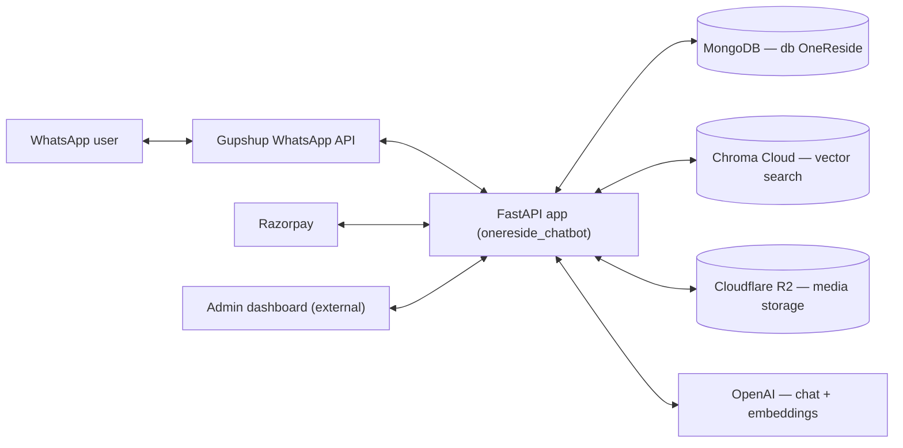
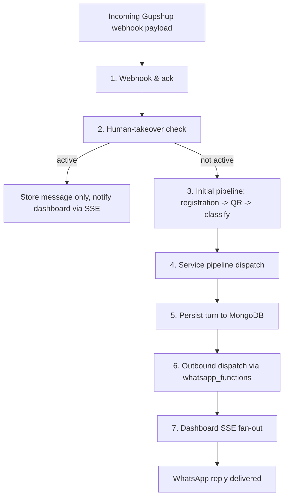
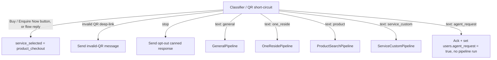

# OneReside Bot — System Architecture

**Author:** Pratham Paleriya (prathampaleriya)
**Last updated:** 2026-07-22

> This doc covers the OneReside WhatsApp bot backend end to end: how an
> inbound WhatsApp message becomes a reply, how payments and the admin
> dashboard fit in, and where data lives. It does not cover deployment
> mechanics in detail (see `standards/container_methods.md`) or the
> business logic inside individual agent prompts (no algorithm doc exists
> yet for the classifier/product-search agents — see §10). Changelog entries
> for this system live in `resources/CHANGELOGS.md`.

---

## 1. What this system computes

For each inbound WhatsApp message on a phone number, the system decides
which of several conversational agents should handle it, produces a reply
(text, media, list, quick-reply, WhatsApp Flow, or CTA), sends it back over
WhatsApp, and persists the full turn for the admin dashboard. Separately, it
tracks Razorpay payment links to completion and exposes a JWT-protected REST
+ SSE API so a human agent can monitor or take over any conversation live.

Unit of computation: one WhatsApp **turn** (one inbound message → one
outbound reply), scoped to a `phone_number`.

---

## 2. Core concepts / glossary

| Term | Meaning |
|---|---|
| `idac` | Variable name for the `users` Mongo collection — one document per WhatsApp phone number. |
| Turn | One inbound message + the bot's reply to it, tracked together via `turn_id` in the `messages` collection. |
| Processor | One pipeline stage (`onereside_chatbot/processors/*.py`) — a single step that reads/mutates the shared `data` dict for a turn. |
| Pipeline | An ordered list of processors, defined in `pipelines/inference_pipeline.py`, selected by `user_profile["service_selected"]`. |
| `ServiceList` | Enum (`models/service_list.py`) of routing categories: `general`, `product_search`, `one_reside`, `product_checkout`, `service_custom`. `agent_request` is a separate classifier category — it flags escalation and never becomes a `service_selected` value. |
| Trace | Per-turn debug record (classifier decision, agent used, tool calls) written by `utils/trace.py` and stored on each `messages` document. |
| Human takeover | A flag on a user's document (`human_takeover.active`) that silences the bot so a human agent can reply manually from the dashboard. |
| Gupshup | The WhatsApp Business API provider all inbound/outbound WhatsApp traffic goes through. |
| Chroma | Cloud-hosted vector database used for semantic product/brand search — separate from MongoDB, which holds the full records. |

---

## 3. System at a glance

Three entry surfaces into the FastAPI app (`onereside_chatbot/main.py`):
`POST /gupshup/message/onereside` (WhatsApp webhook), `POST
/razorpay/webhook` (payment events), and `/system/*` (JWT-protected admin
REST + SSE, mounted from `routes/systems.py`).

---

## 4. Inbound WhatsApp message pipeline

### 4.1 Webhook & ack
Gupshup posts every WhatsApp event to `POST /gupshup/message/onereside`
(`main.py:388`). Status-only callbacks and stray payloads are filtered and
acked immediately. Real messages are handed to `process_message(request_data)`
as a FastAPI `BackgroundTasks` job so the webhook can return `{"success":
true}` without waiting on the LLM pipeline — there is no external queue
(Celery/RQ/Kafka); background tasks run in-process.

### 4.2 Human-takeover check
`process_message` (`main.py:246`) reads the user's `idac` document first. If
`human_takeover.active` is true, the bot stays silent: the message is saved
(`save_user_message_only`) and published to the dashboard over SSE, and
processing stops there.

### 4.3 Initial pipeline — registration, QR, classify
`InitialPipeline` (`pipelines/inference_pipeline.py`) runs three processors
in order:
1. **`UserRegistration`** — gets or creates the user's `idac` profile.
2. **`QRProcessor`** — detects the WhatsApp QR deep-link pattern ("I'm
   interested in `{brand}` featured in One Reside"), resolves the brand from
   Mongo, and sets brand context on the profile.
3. **`Classifier`** — calls OpenAI `gpt-4.1-mini` (`prompt/classifier.py`)
   to assign a `ServiceList` category to free-text messages, or short-circuits
   routing directly from button/WhatsApp-Flow replies.

### 4.4 Service pipeline dispatch
If the initial pipeline hasn't already produced a `bot_response` (e.g. an
opt-out or invalid-QR message), the matching service pipeline runs, keyed off
`user_profile["service_selected"]`:

| Pipeline | Target | Key tools / sources | Output |
|---|---|---|---|
| `GeneralPipeline` / `OneResidePipeline` | Platform & brand Q&A | `search_brands` / `list_all_brands` over Chroma + Mongo `company` | Text/media reply |
| `ProductSearchPipeline` | Ready-made product discovery | Multi-turn tool loop: `search_products` / `get_product_by_id` / `compare_products` / `search_brand` — Chroma for semantic candidate IDs, Mongo `product` for full docs — then a separate presenter LLM call formats the final reply | Text + product media/list |
| `ProductCheckoutPipeline` | Ordering a selected product | Address collection → Razorpay payment link → `orders` doc | Payment-link message |
| `ServiceCustomPipeline` | Custom/made-to-order & service enquiries | Brand/service/custom-product flow, catalogue PDF/image delivery from R2 | Text + media/catalogue |

All variants read/write the same `data` dict shape (`bot_response`,
`user_profile`) so `ResponseManager` and persistence work identically
regardless of which pipeline ran.

### 4.5 Persistence
`save_to_mongo(data)` (`database/user_utils.py`) upserts the `idac` profile
(`$set` for non-chat fields, `$push`+`$slice` for a rolling `chat_history`
window capped at `CHAT_HISTORY_MAX = 200`) and calls `save_turn_messages` to
append full per-message documents — including the debug `trace` — to the
append-only `messages` collection.

### 4.6 Outbound dispatch
`ResponseManager().handle_responses(data)` walks the typed `bot_response`
parts (`text`, `media`, `quickreply`, `flow`, `list`, `cta_url`, `template`,
`skip`) and dispatches each to its matching sender in
`whatsapp_functions/` (`send_text_message`, `send_image_message`,
`send_quickreply`, `send_address_flow`, `send_cta_url`, …), which calls
Gupshup.

### 4.7 Dashboard fan-out
`publish_turn_events(data)` pushes the turn (user + bot messages, plus the
trace) to any subscriber of that phone number via `PubSubManager`
(`utils/pubsub.py`, an in-process `asyncio.Queue` per number), consumed by
the dashboard's SSE stream (`GET /system/conversations/{phone_number}/stream`).

Any exception anywhere in §4.3–§4.6 is caught, logged, traced as a
`pipeline_error` event, and a fallback "Unexpected error occured." reply is
sent, saved, and published — the user always gets a reply even on failure.

---

## 5. Payments flow (Razorpay)

`POST /razorpay/webhook` (`main.py:75`) verifies the request's HMAC-SHA256
signature against `RAZORPAY_WEBHOOK_SECRET`, then handles
`payment_link.paid|cancelled|expired` and `payment.failed` events:

1. Records the raw event in the `payments` collection.
2. Updates the matching `orders` document by `payment_link_id`
   (`payment_status`, `payment_event`, `razorpay_payment_id`).
3. Sends a WhatsApp payment-status template to the customer, and to the
   numbers in `SUPPORT_NOTIFY_NUMBERS`.

The payment link itself is created earlier, inside `ProductCheckoutPipeline`
(§4.4), via `utils/razorpay_utils.py`.

---

## 6. Admin dashboard API & live takeover

`/system/*` (`routes/systems.py` + `routes/system_sub_routes/*`) is a
separate, synchronous REST surface for an external admin dashboard
(`dash.onereside.claraai.tech`, `onereside-dashboard.vercel.app`), guarded on
every route by `verify_api_key` (`routes/dependencies.py`), a JWT bearer
check issued by `auth.py` against a single hardcoded admin
username/password pair (`LOGIN_USERNAME` / `LOGIN_PASS`).

Covers: `users`, `products`, `brands`, `orders`, `enquiries`, `payments`
CRUD/read endpoints, plus `conversations.py` — SSE live stream, paginated
history, human takeover/release, agent-send-message, and agent-request
resolution. This is the consumer of the SSE fan-out in §4.7.

---

## 7. Data layer

### 7.1 MongoDB (db `OneReside`)

| Collection | Holds |
|---|---|
| `users` (`idac`) | One doc per phone number: profile, `service_selected`, rolling `chat_history` (max 200), brand context, `human_takeover`, `agent_request`. |
| `messages` | Append-only per-message log: `phone_number`, `turn_id`, `role`, `type`, `content`, `raw`, `context` (trace), `timestamp`. Indexed on `(phone_number, timestamp desc)`. |
| `company` | Brand documents: `brand_id`, name, pitch, categories offered, catalogue URL (R2). |
| `product` | Product documents: `product_id` (`{BRAND}-{CAT}-{RANDOM}`), brand, category, price, attributes, `media_url` (R2). |
| `orders` | `order_id` (`ORD-YYYYMMDD-HEX`, unique sparse index), product, address, amount, payment link/status. |
| `payments` | Razorpay payment records (raw event + parsed fields). |
| `enquiries` | Brand/product enquiries with `status`. |
| `refunds` | Declared in `collections.py`; no read/write code exists yet — placeholder. |

### 7.2 Chroma Cloud
Separate from Mongo — database `"OneReside"`, two collections: `product`
(embeddings of name/category/type/size/description/style tags/materials,
metadata `{brand_id, category, product_id}`) and `brands` (embeddings of
name/description/categories). Both embedded with OpenAI
`text-embedding-3-small`. Chroma returns candidate IDs only; full records are
always hydrated from Mongo before use.

### 7.3 Cloudflare R2
S3-compatible object storage (`database/storage/`) for product images and
brand catalogues, accessed via `boto3`. Upload/update/delete return public
URLs (`r2_public_url`) stored on `product.media_url` and `company.catalogue_url`.

---

## 8. Deployment & operations

Full detail lives in `standards/container_methods.md` — this repo follows it:
multi-stage `Dockerfile` (non-root `appuser`, slim pinned base), `GET/HEAD
/ping` health route, `docker-compose.yml` with `restart: unless-stopped` +
healthcheck + `autoheal` sidecar + size-capped JSON logging, a host
`logrotate` rule (2-day retention), stdout-only logging (no in-container
`FileHandler`), and a GitHub Actions deploy (`.github/workflows/deployment.yaml`)
that builds/pushes to Vultr Container Registry and deploys over SSH with
secrets written fresh from GitHub Actions each run. Local dev uses
`compose.yaml` with a live-reload volume mount instead of the built image.

---

## 9. Key parameters & flags

| Parameter | Where | Effect |
|---|---|---|
| `CHAT_HISTORY_MAX` | `database/user_utils.py` | Caps `users.chat_history` to the most recent 200 entries. |
| `EMBEDDING_MODEL` / `TEXT_EMBEDDING_MODEL` | `constants.py` | `text-embedding-3-small` — used for both product and brand Chroma embeddings. |
| Classifier/general model | `processors/classifier.py`, `general_agent.py`, `one_reside_agent.py` | `gpt-4.1-mini`. |
| Product-search / service-custom model | `processors/product_search_agent.py`, `service_custom_agent.py` | `gpt-5.2`. |
| `GUPSHUP_URL` / `GUPSHUP_SOURCE` | `constants.py` | Fixed Gupshup send endpoint and OneReside's WhatsApp sender number. |
| `SUPPORT_NOTIFY_NUMBERS` | `constants.py` | Numbers notified on payment status events (§5). |

---

## 10. Edge cases & notes

- **Two vector-store integrations exist side by side.** `database/chroma/`
  is the vector store actually queried by every pipeline; a separate
  `database/pinecone/` module (with its own `PINECONE_API` /
  `PINECONE_NAMESPACE` env vars) also exists but isn't called from any
  pipeline or processor.
- **`example.env` lists a subset of the environment variables the app
  reads.** The authoritative list of what's actually consumed at runtime is
  `utils/env_load.py`, not `example.env`.
- **Several Mongo collections are declared but not queried by any current
  pipeline**: `git_bookings`, `bookings`, `pims_calls`, `pims_systems`
  (`database/collections.py`).
- **Voice replies are a separate delivery path from text/media/template.**
  `whatsapp_functions/audio/send_elevnlabs_voice.py` sends WhatsApp audio
  replies via ElevenLabs, alongside the Gupshup text/media/template senders
  used by everything else.

