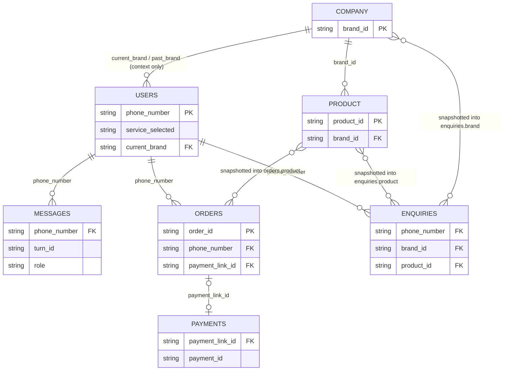

# OneReside Bot — Database Design

**Author:** Pratham Paleriya (prathampaleriya)
**Last updated:** 2026-07-22

> This doc covers the data layer in field-level detail: every MongoDB
> collection's schema, the Chroma Cloud vector collections, and the
> Cloudflare R2 object-key layout — plus how they relate to each other. For
> *how* this data is produced and consumed (the message pipeline, payment
> flow, admin API), see `resources/ARCHITECTURE.md` §4–§7, which this doc
> assumes as background rather than re-explaining.

---

## 1. What this doc covers

For every document store the system touches — MongoDB (`OneReside` db),
Chroma Cloud, and Cloudflare R2 — this doc answers: what fields exist, what
they mean, which fields are natural keys vs. auto-generated IDs vs.
denormalized snapshots, and which indexes exist. It does not cover pipeline
or processor logic (see `ARCHITECTURE.md`).

---

## 2. Core concepts / glossary

| Term | Meaning |
|---|---|
| Natural key | A business-meaningful identifier (`phone_number`, `brand_id`, `product_id`, `order_id`) used for lookups instead of `_id`. |
| Snapshot field | A field that copies data from another collection **at write time** rather than referencing it — it will not reflect later edits to the source (e.g. `orders.product`). |
| `idac` | Code-level variable name for the `users` collection. |
| Rolling window | `chat_history` on `users` — capped at the most recent `CHAT_HISTORY_MAX = 200` entries via `$push` + `$slice`, distinct from the unbounded `messages` collection. |
| Sparse unique index | An index that enforces uniqueness only on documents where the field is present (used for `orders.order_id`, added after the collection already existed). |

---

## 3. Data layer at a glance

All relationships are **application-enforced**, not database-enforced —
MongoDB has no foreign keys here. `ORDERS`/`ENQUIRIES` → `PRODUCT`/`COMPANY`
links are snapshots (§4.4, §4.7), not live references, by design (see §9).

---

## 4. Collection: `users` (code name `idac`)

One document per WhatsApp phone number — the live conversation state.

| Field | Type | Notes |
|---|---|---|
| `_id` | ObjectId | Mongo default. |
| `phone_number` | string | Natural key. **No unique index exists** — see §9. |
| `username` | string | WhatsApp display name; overwritten on every turn. |
| `service_selected` | string | A `ServiceList` value (`general`, `product_search`, `one_reside`, `product_checkout`, `service_custom`) or `""` when no pipeline currently owns the conversation. |
| `chat_history` | array of `{role, content, timestamp}` | Rolling window, capped at `CHAT_HISTORY_MAX = 200`. |
| `current_brand` | string (`brand_id`) | Set when a QR scan puts the user in a brand's context. |
| `past_brand` | string (`brand_id`) | Previous `current_brand`, kept when context is cleared or switched. |
| `requested_brand` | `{brand_id, brand_name}` \| `null` | A brand explicitly asked for mid-conversation during product search; reset on QR scan. |
| `pending_needs` / `resolved_needs` | array of strings | Product-search agent's running list of unmet vs. satisfied requirements for the current ask. |
| `shown_products` | array of `product_id` | Products already surfaced this session (avoids repeats). |
| `shown_brands` | array of `brand_id` | Brands already surfaced by the service-custom agent. |
| `last_shown_product` | string (JSON-encoded product dict) | Injected into follow-up prompts so the LLM knows what "it" refers to. |
| `selected_product_id` | dict (full product doc) \| `{}` | Product mid-checkout — despite the name, holds the **full product document**, not just an ID. |
| `address` | `{address, pin_code, city, state, country, personal_details: {first_name, last_name, phone_number, email, wa_phone}}` | Captured via the WhatsApp "address" Flow. |
| `agent_request` | bool | Set `true` when the classifier detects an escalation request; cleared via the admin API. |
| `human_takeover` | `{active, taken_by, taken_at}` | Set by the admin dashboard; while `active`, the bot pipeline never runs for this user. |
| `updated_at` | int (unix seconds) | Set on every write. |

No secondary indexes beyond the default `_id`.

---

## 5. Collection: `messages`

Append-only, one document per sent/received message — the full audit log
behind the admin dashboard (distinct from the `chat_history` rolling window
on `users`).

| Field | Type | Notes |
|---|---|---|
| `_id` | ObjectId | |
| `phone_number` | string | |
| `turn_id` | string (uuid4 hex) \| `null` | Groups one inbound message with all outbound reply parts from the same turn. `null` for takeover-mode single sends (`save_single_message`), which aren't part of a pipeline turn. |
| `role` | `"user"` \| `"assistant"` \| `"human_agent"` | |
| `type` | string | WhatsApp message type (`text`, `image`, …) for inbound, or the `bot_response` part type for outbound. |
| `content` | string | Human-readable formatted text, built by `format_user`/`format_assistant`. |
| `raw` | dict | Original inbound payload, or the outbound response part as sent. |
| `context` | dict \| `null` | Debug trace (classifier decision, agent used, tool calls) for assistant messages; `{"source": "human_takeover"}` for manual sends; `null` for user messages. |
| `timestamp` | int (unix seconds) | |

**Index:** `(phone_number: 1, timestamp: -1)` — supports the dashboard's
paginated per-user history query (`get_messages_page`).

---

## 6. Collection: `company` (brands)

| Field | Type | Notes |
|---|---|---|
| `_id` | ObjectId | |
| `brand_id` | string | Slug auto-generated from `brand_name` (deduped with a `-1`, `-2`… suffix on collision); immutable after creation. |
| `brand_name` | string | |
| `brand_description` / `brand_short_pitch` / `brand_additional_context` | string | Prompt-injection copy consumed by the LLM agents. |
| `categories_offered` | array of strings | |
| `has_ready_products` / `has_custom_products` / `has_services` | bool | Drive which service pipeline should route to this brand and gate what Chroma metadata filters match it. |
| `catalogue_url` | string | Cloudflare R2 public URL (see §10). |

---

## 7. Collection: `product`

| Field | Type | Notes |
|---|---|---|
| `_id` | ObjectId | |
| `product_id` | string | Format `{BRAND_CODE}-{CATEGORY_CODE}-{RANDOM6}` — e.g. brand code = first 3 alnum chars of `brand_id` uppercased, category code = first letters of each category word. Regenerated on collision. |
| `brand_id` | string | References `company.brand_id` (app-enforced, no DB constraint). |
| `name` / `category` / `description` | string | |
| `listing_type` | `"product"` \| `"service"` | |
| `type` | `"ready_product"` \| `"made_to_order"` \| `null` | Only meaningful when `listing_type == "product"`; auto-defaulted to `"ready_product"` on create if `listing_type == "product"` and `type` wasn't supplied. |
| `price_inr` | number | |
| `size` | string | |
| `style_tags`, `materials`, `ideal_for`, `colors_available`, `deliverables` | array of strings | Attribute facets — also folded into the Chroma embedding text (§9). |
| `media_url` | array of `{type, url}` | `type` is `"image"`/`"video"`; `url` is an R2 public URL under `products/` (§10). |

No secondary indexes beyond `_id`; lookups go through `product_id` (no
unique index enforced at the DB level — uniqueness is guaranteed only by the
collision-check loop in `_generate_product_id`).

---

## 8. Collection: `orders`

| Field | Type | Notes |
|---|---|---|
| `_id` | ObjectId | |
| `order_id` | string, **unique sparse index** | Format `ORD-YYYYMMDD-{RANDOM6HEX}`, generated with a 5-attempt collision retry (`_generate_order_id` + `DuplicateKeyError` catch). |
| `phone_number` / `username` | string | |
| `product` | dict | **Snapshot** of the full product doc as of checkout (from `users.selected_product_id`) — later edits to the source `product` document do not propagate. |
| `address` | dict | Snapshot of `users.address` at checkout time (same shape as §4). |
| `amount_inr` / `amount_paise` | number | |
| `payment_link_id` / `payment_short_url` | string | Razorpay payment-link identifiers. |
| `razorpay_payment_id` | string \| `null` | `null` until the Razorpay webhook fires. |
| `payment_status` | string | `"pending"` on creation; updated to Razorpay's status by the webhook. |
| `payment_event` | string | Last Razorpay event name applied to this order. |
| `created_at` / `updated_at` | int (unix seconds) | |

**Index:** `order_id` unique + sparse (`sparse=True` — needed because the
index was added after the collection already had documents without the
field; new writes always set it, so in practice it now behaves as a normal
unique index).

---

## 9. Collection: `payments`

Raw Razorpay webhook events, one document per event received.

| Field | Type | Notes |
|---|---|---|
| `_id` | ObjectId | |
| `payment_id` / `payment_link_id` | string | |
| `event` | string | Razorpay event name (`payment_link.paid`, `payment.failed`, …). |
| `amount` / `currency` | number / string | |
| `status` | string | |
| `method` | string | Payment method used. |
| `contact` | string | Customer phone number as reported by Razorpay; matched to a `phone_number` via a trailing-digits regex (`get_payments_by_phone`), since formatting (`+`, country code) can differ. |
| `captured` | bool | |
| `raw_payload` | dict | Full webhook body, kept for auditing/debugging. |
| `created_at` | int (unix seconds) | |

No secondary indexes; queried by `contact` (regex) or `_id`.

---

## 10. Collection: `enquiries`

Brand-level or product-level "someone wants to talk to a human" records.

| Field | Type | Notes |
|---|---|---|
| `_id` | ObjectId | |
| `phone_number` / `username` | string | |
| `type` | `"brand_enquiry"` for brand enquiries; **not set** for product enquiries (see §12) | |
| `brand` | `{brand_id, brand_name}` | Present on brand enquiries; snapshot, not a reference. |
| `product` | `{product_id, name, brand_id, brand_name, category}` | Present on product enquiries; snapshot, not a reference. |
| `status` | string | `"pending"` on creation, updatable to any string via the admin API — no enforced enum. |
| `created_at` | int (unix seconds) | |

No secondary indexes; admin API queries filter by `status`, `type`,
`brand_id` (matched against either `product.brand_id` or `brand.brand_id`
via `$or`), or `phone_number`.

---

## 11. Collection: `refunds`

Declared in `database/collections.py` but no read/write helper exists
anywhere in `onereside_chatbot` — a placeholder for future refund tracking.

---

## 12. Legacy/unused collections

`git_bookings`, `bookings`, `pims_calls`, `pims_systems` are declared in
`database/collections.py` but not referenced anywhere else in
`onereside_chatbot` — leftovers from a prior project template (also flagged
in `ARCHITECTURE.md` §10).

---

## 13. Chroma Cloud (vector store)

Separate from MongoDB — cloud-hosted, database `"OneReside"`, embeddings via
OpenAI `text-embedding-3-small`. Holds only search text + metadata; full
records always live in MongoDB and are hydrated after a Chroma query
returns candidate IDs.

| Collection | Embedded text (`build_search_text` / `_build_brand_text`) | Metadata (filterable) |
|---|---|---|
| `product` | name, category, type, size, description, style tags, materials, ideal for, colors available, deliverables | `{brand_id, category, product_id}` |
| `brands` | brand name, brand description, categories offered | `{brand_id, brand_name, categories_offered, has_ready_products, has_custom_products, has_services}` |

IDs: `product` collection uses the same `product_id` as MongoDB; `brands`
uses the same `brand_id`. A client is created fresh per operation
(`_get_collections`) rather than reused, to avoid stale-connection issues.

---

## 14. Cloudflare R2 (object storage)

S3-compatible bucket accessed via `boto3` (`database/storage/`). Keys are
chosen by the caller (routes), not generated inside the storage layer:

| Key pattern | Used for |
|---|---|
| `products/{uuid4_hex}.{ext}` | Product images/videos, uploaded via `POST /system/products/media/upload`. |
| `brands/catalogues/{uuid4_hex}.{ext}` | Brand catalogue/brochure files, uploaded via `POST /system/brands/catalogue/upload`. |

`upload_media` returns `{r2_public_url}/{key}` as the stored URL
(`product.media_url[].url`, `company.catalogue_url`). Deleting a product or
updating its `media_url` list extracts the R2 key back out of the public URL
(`_extract_r2_key`, string-prefix strip) to clean up orphaned objects — this
only works if `r2_public_url` never changes, since the key-extraction logic
has no fallback.

---

## 15. Edge cases & notes

- **`users.phone_number` uniqueness is enforced at the application level**,
  via `find_one_and_update` with `upsert=True`, rather than by a database
  index.
- **`product.product_id` uniqueness is enforced by a collision-check loop**
  at generation time (`_generate_product_id`), rather than by a database
  index.
- **`enquiries.type` is set only for brand enquiries** (`"brand_enquiry"`).
  Product enquiries are distinguished instead by carrying a `product`
  subdocument (with no `type` field of their own) rather than a `brand` one.
- **`users.selected_product_id` holds the full product document**, not a
  product ID string, despite the field name.
- **Snapshot fields drift by design.** `orders.product`, `enquiries.product`,
  and `enquiries.brand` are copied at write time; a later price or name
  change on the source `product`/`company` document does not retroactively
  update historical orders or enquiries — an order reflects what was
  actually bought at the time, not the product's current state.
- **`orders.order_id`'s unique index is sparse**, created at application
  import time (`collections.py:18`) so it also accommodates any documents
  that predate the index.
- **Orphaned-media cleanup on R2 matches by URL prefix.**
  `_extract_r2_key` recovers a stored object's key by stripping the current
  `r2_public_url` prefix from its saved URL.

---

